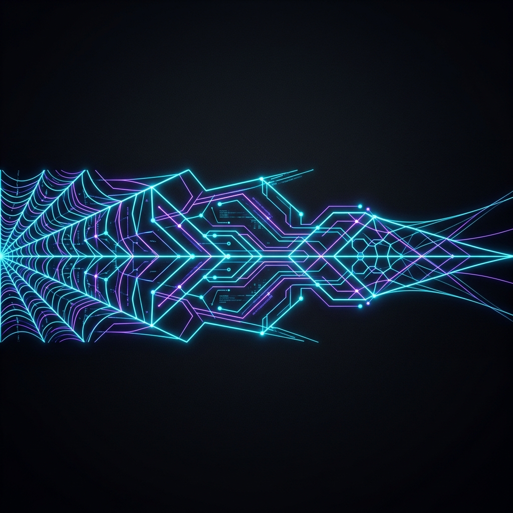
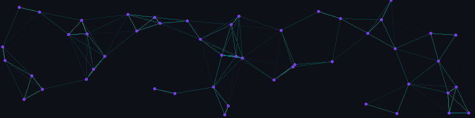

  

<h1 align="center">white-spider-200</h1>

  <strong>Agentic AI Builder | Linux Systems Architect | Security-Focused Automation Engineer</strong>

  <em>Building autonomous pipelines, resilient systems, and high-performance digital experiences.</em>

  
  
  
  

  
  
  
  

  

  

<table width="100%">
  <tr>
    <td width="62%" valign="top">
      <h2>Mission Control</h2>
      

        I build at the intersection of <strong>agentic AI</strong>, <strong>system architecture</strong>,
        <strong>Linux environments</strong>, and <strong>security research</strong>. My work focuses on
        practical automation, clean orchestration, and tools that feel powerful without becoming fragile.
      

      

        Current direction: autonomous LLM workflows, MCP integrations, custom Hyprland shells,
        declarative infrastructure, containerized services, and secure system design.
      

    </td>
    <td width="38%" valign="top">
      <h2>Node Status</h2>
      <pre>
system.logic      :: active
core.focus        :: LLM + MCP orchestration
desktop.shell     :: Hyprland / QML
infra.stack       :: NixOS / Docker
security.mode     :: research + hardening
creative.engine   :: Godot / Blender
      </pre>
    </td>
  </tr>
</table>

  

<h2 align="center">Now Building</h2>

<table width="100%">
  <tr>
    <td width="25%" valign="top" align="center">
      <h3>Agents</h3>
      
Autonomous LLM workflows, MCP integrations, and orchestration patterns.

    </td>
    <td width="25%" valign="top" align="center">
      <h3>Systems</h3>
      
Declarative Linux environments, containerized services, and reproducible setups.

    </td>
    <td width="25%" valign="top" align="center">
      <h3>Security</h3>
      
Recon tooling, secure design, system hardening, and practical research.

    </td>
    <td width="25%" valign="top" align="center">
      <h3>Interfaces</h3>
      
Modern web products, dashboards, landing pages, and polished developer tools.

    </td>
  </tr>
</table>

  

<h2 align="center">Real Project Showcase</h2>

<table width="100%">
  <tr>
    <td width="50%" valign="top">
      <h3><a href="https://github.com/white-spider-200/trustech">Trustech</a></h3>
      
High-performance bilingual landing page for a premium digital agency, built with a tech-luxury visual system.

      

        
        
        
      

    </td>
    <td width="50%" valign="top">
      <h3><a href="https://github.com/white-spider-200/adroyds">Adroyts Project</a></h3>
      
Decoupled web system with a Laravel backend API, admin assets, and React customer-facing frontend.

      

        
        
        
      

    </td>
  </tr>
  <tr>
    <td width="50%" valign="top">
      <h3><a href="https://github.com/white-spider-200/IMS-pro">IMS Pro</a></h3>
      
Accounting and inventory management system with React/Vite frontend, Express API, Prisma, and PostgreSQL.

      

        
        
        
      

    </td>
    <td width="50%" valign="top">
      <h3><a href="https://github.com/white-spider-200/hypershortcut">Hyprland Visual Shortcut Builder</a></h3>
      
Interactive web app for building, validating, and managing Hyprland shortcut bindings visually.

      

        
        
        
      

    </td>
  </tr>
  <tr>
    <td width="50%" valign="top">
      <h3><a href="https://github.com/white-spider-200/webhexflow">WebHexFlow</a></h3>
      
Python web reconnaissance tool for gathering metadata, scanning targets, and generating structured reports.

      

        
        
        
      

    </td>
    <td width="50%" valign="top">
      <h3><a href="https://github.com/white-spider-200/fasttechno">FastTechno</a></h3>
      
Static single-page marketing website built with plain HTML, CSS, and JavaScript.

      

        
        
        
      

    </td>
  </tr>
</table>

  

<h2 align="center">Tech Arsenal</h2>

<table width="100%">
  <tr>
    <td align="center" width="22%"><strong>Languages</strong></td>
    <td>
      
      
      
      
      
      
    </td>
  </tr>
  <tr>
    <td align="center"><strong>AI & Agents</strong></td>
    <td>
      
      
      
      
    </td>
  </tr>
  <tr>
    <td align="center"><strong>Frontend</strong></td>
    <td>
      
      
      
      
      
    </td>
  </tr>
  <tr>
    <td align="center"><strong>Backend & Data</strong></td>
    <td>
      
      
      
      
      
    </td>
  </tr>
  <tr>
    <td align="center"><strong>Systems</strong></td>
    <td>
      
      
      
      
      
    </td>
  </tr>
  <tr>
    <td align="center"><strong>Creative</strong></td>
    <td>
      
      
      
    </td>
  </tr>
</table>

  

<h2 align="center">Credibility Matrix</h2>

<table width="100%">
  <tr>
    <td width="33%" valign="top">
      <h3>Product Engineering</h3>
      
Full-stack builds, bilingual interfaces, dashboard systems, and production-minded UI architecture.

    </td>
    <td width="33%" valign="top">
      <h3>Automation & AI</h3>
      
Agent workflows, AI Studio apps, LLM orchestration, and tool-driven development pipelines.

    </td>
    <td width="33%" valign="top">
      <h3>Security & Infrastructure</h3>
      
Web reconnaissance, hardening mindset, Linux systems, Docker stacks, and reproducible environments.

    </td>
  </tr>
</table>

  

<h2 align="center">GitHub Analytics</h2>

  <picture>
    <source media="(prefers-color-scheme: dark)" srcset="https://raw.githubusercontent.com/white-spider-200/white-spider-200/output/github-contribution-grid-snake-dark.svg">
    <source media="(prefers-color-scheme: light)" srcset="https://raw.githubusercontent.com/white-spider-200/white-spider-200/output/github-contribution-grid-snake.svg">
    
  </picture>

  
  

  

  

  

